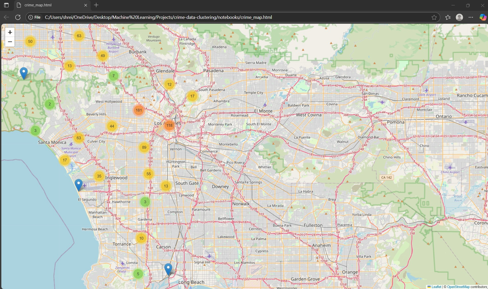
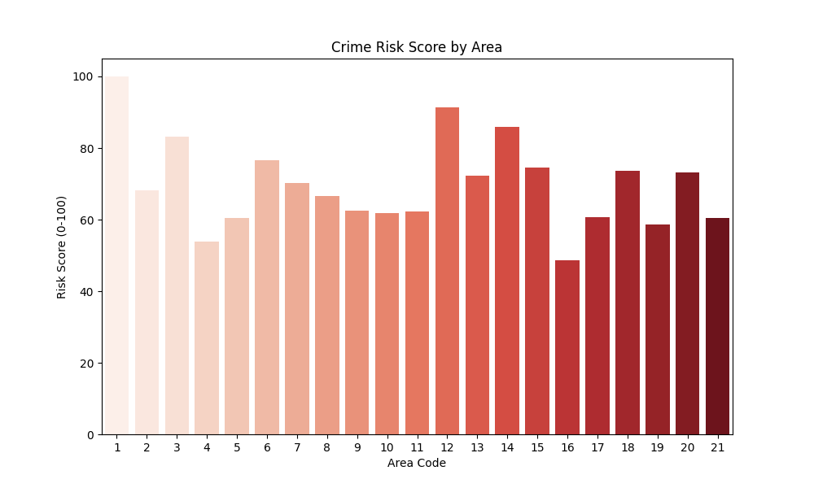
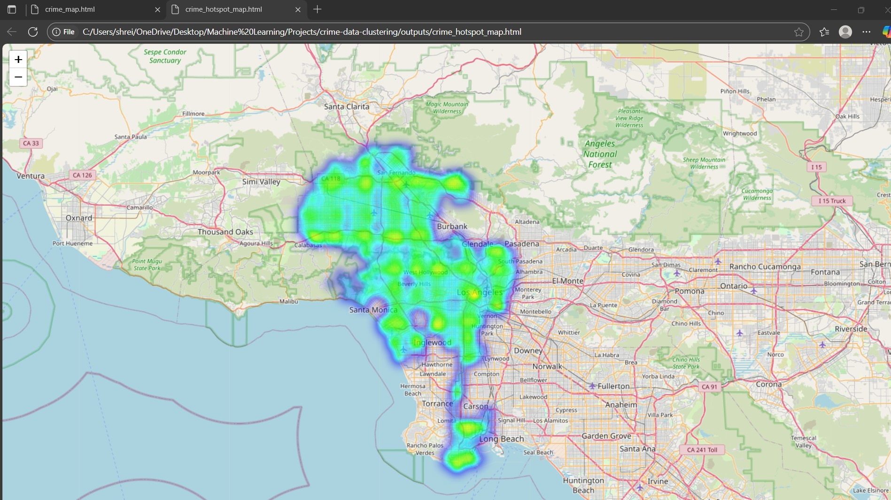

# Crime Pattern Clustering 🕵️‍♂️📍

Detecting Crime Hotspots in Los Angeles Using Machine Learning and Geospatial Analysis

## Table of Contents
- [Project Description](#project-description)
- [Methodology](#methodology)
- [Screenshots & Visualizations](#screenshots--visualizations)
- [Technologies & Tools](#technologies--tools)
- [Project Structure](#project-structure)
- [Usage](#usage)


## Project Description
Crime poses significant safety and resource challenges in urban environments like Los Angeles. This project leverages unsupervised machine learning and geospatial analysis to identify spatial and temporal crime hotspots.

The insights generated can assist law enforcement with:
- Patrol planning
- Risk assessment
- Policy decisions

## Features
- Detects high-crime clusters using K-Means Clustering
- Provides a crime risk score (0–100) for different areas
- Interactive maps and visualizations of crime patterns
- Explores temporal trends (hour of day, day of week)
- Scalable and reproducible data preprocessing pipeline

## Methodology
- **K-Means Clustering:** Identifies crime clusters from spatial, temporal, and categorical features
- **PCA:** Reduces dimensionality for visualization and cluster validation
- **Evaluation:** Cross-checked clusters against temporal and spatial patterns to ensure meaningful hotspot detection

## Screenshots & Visualizations

**Interactive Crime Distribution Map**  
Visualizes individual crime incidents across Los Angeles.  


**Crime Risk Score by Area**  
Assigns a score (0–100) based on total crime counts.  


**Crime Hotspot Map**  
Highlights significant clusters of criminal activity.  


## Technologies & Tools
- **Languages:** Python 3.11
- **Libraries:** Pandas, NumPy, Matplotlib, Scikit-learn, Folium
- **Machine Learning:** K-Means Clustering, PCA


##  Project Structure
```
crime-pattern-clustering
├── data/ # Contains downaloded dataset
├── outputs/ # Outputs are saved here 
├── src/
| ├── cluster.py
| ├── visualization.py
| ├── preprocess.py
├── utils/
| ├── download_data.py
├── main.py
├── requirements.txt
```

## Usage

1. Clone the repo
   ```bash
   git clone https://github.com/Shreiya-Muthuvelan/Crime-Pattern-Clustering.git
   cd crime-pattern-clustering
2. Install required libraries
   ```bash
   pip install -r requirements.txt
3. Download dataset
   ```bash
   python utils/download_data.py
4. Run Clustering Pipeline
   ```bash
   python main.py
   

